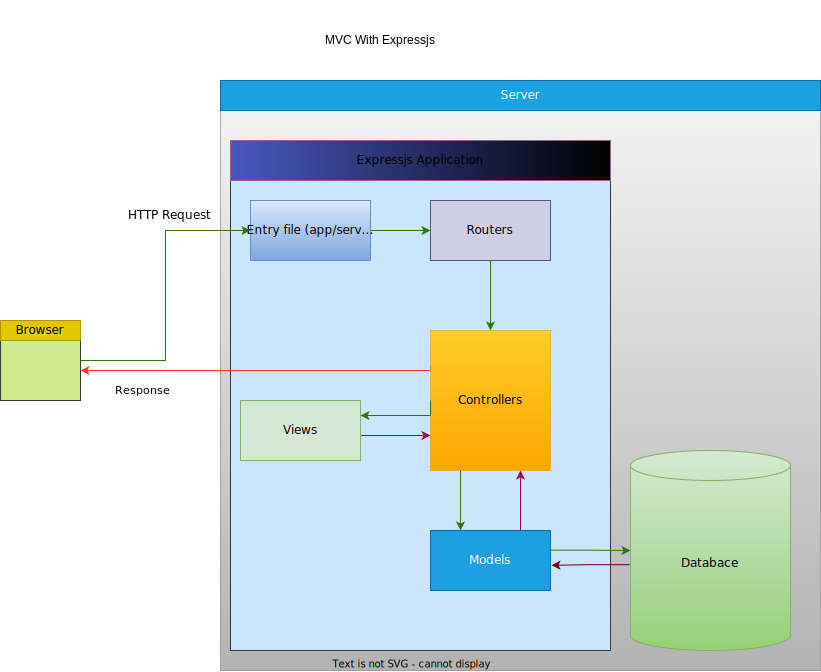

# Book Store
> This Project to store/brows books in our store

## Content
  - [Book Store](#Book-Store)
  - [Content](#content)
  - [Project Structure](#project-structure)
  - [Project Routes](#project-routes)
  - [Project Controllers](#project-controllers)
  - [EJS View Engine](#ejs-view-engine)


## Project Structure
```bash
.
├── controllers
│   ├── bookscontroller.js
│   └── mainController.js
├── data
│   ├── authors.json
│   └── books.json
├── models
├── public
│   ├── css
│   │   └── style.css
│   ├── images
│   └── js
│       └── script.js
├── routes
│   ├── authors.js
│   ├── books.js
│   └── index.js
├── views
│   ├── content
│   │   ├── 404.ejs
│   │   ├── book.ejs
│   │   ├── books.ejs
│   │   └── home.ejs
│   ├── partials
│   │   └── navbar.ejs
│   └── mainTemplate.ejs
├── app.js
├── package.json
├── package-lock.json
├── README.md
├── TASKS.md
└── test.js

```



<hr>

## Project Routes
All routes located in [routes](./routes/) Folder.
- [books Router](./routes/books.js)
- [authors Router](./routes/authors.js)
- [home/index routes](./routes/index.js)

<hr>

## Project Controllers
All controllers located in [controllers](./controllers/) Folder.
- [books Controller](./controllers/bookscontroller.js)
- [main Controller](./controllers/mainController.js)


<hr>

## EJS View Engine
All views files located in [views](./views/) Folder.
- [mainTemplate](./views/mainTemplate.ejs)
- [partials](./views/partials/) Folder.
  - [navbar](./views/partials/navbar.ejs).
- [content](./views/content/) Folder.
  - [home](./views/content/home.ejs)
  - [books](./views/content/books.ejs)
  - [404](./views/content/404.ejs)

<hr>
